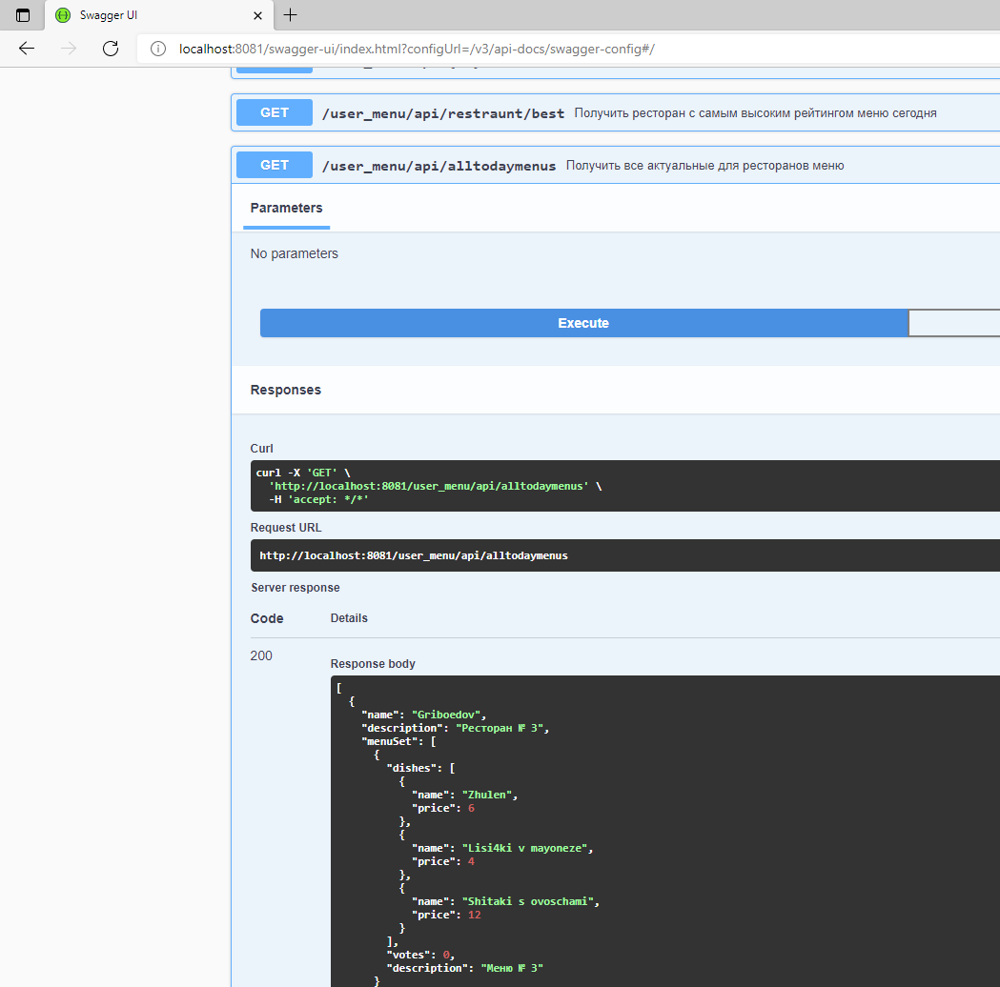
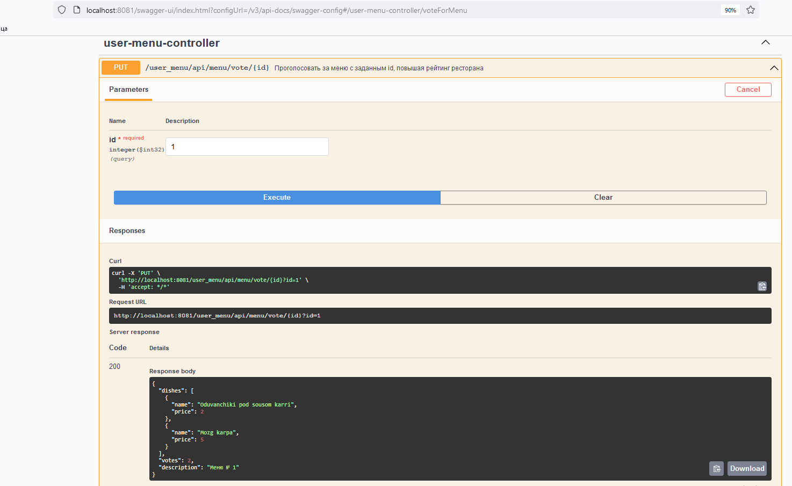
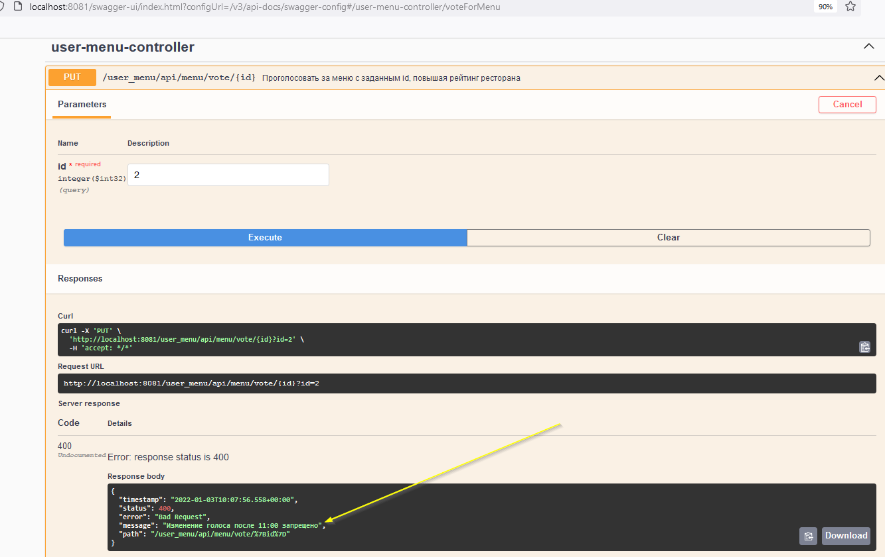
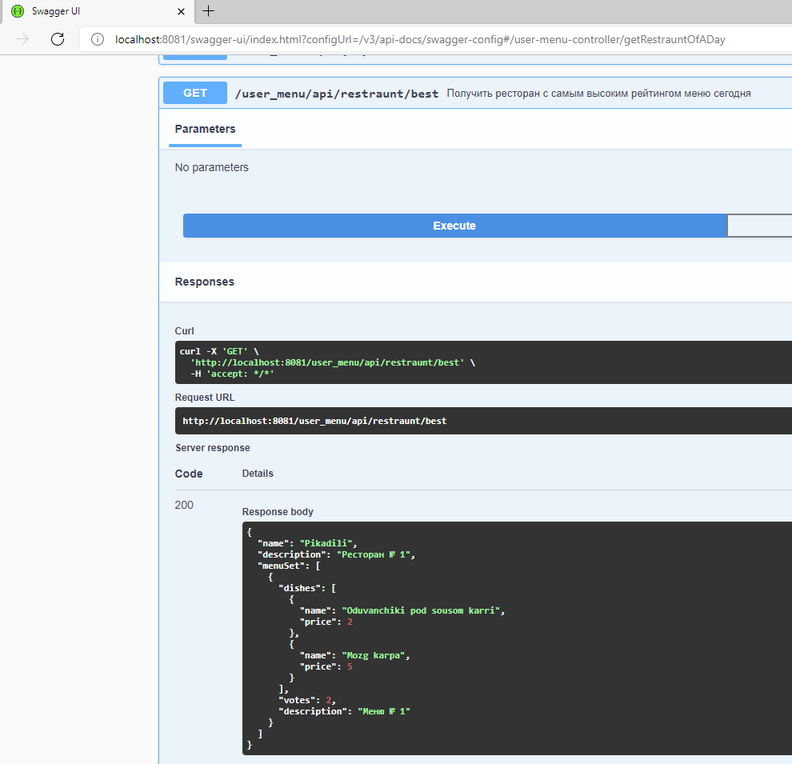
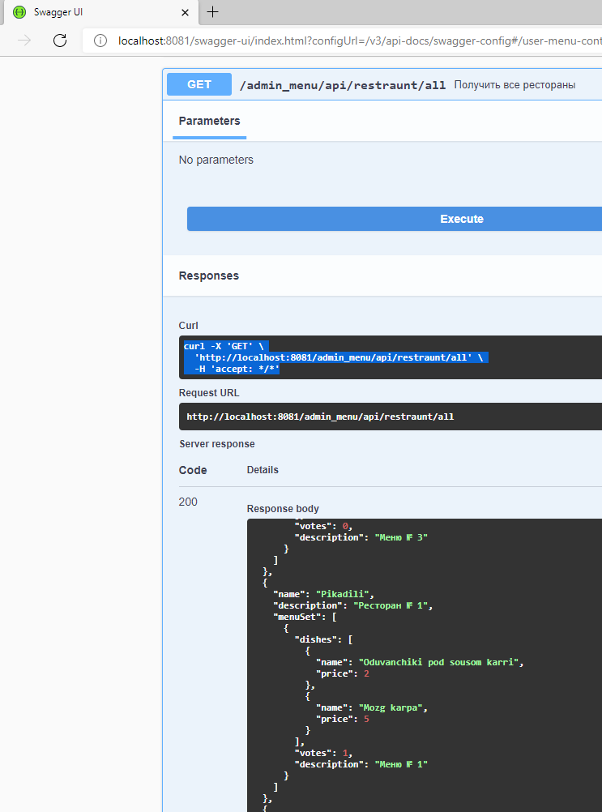
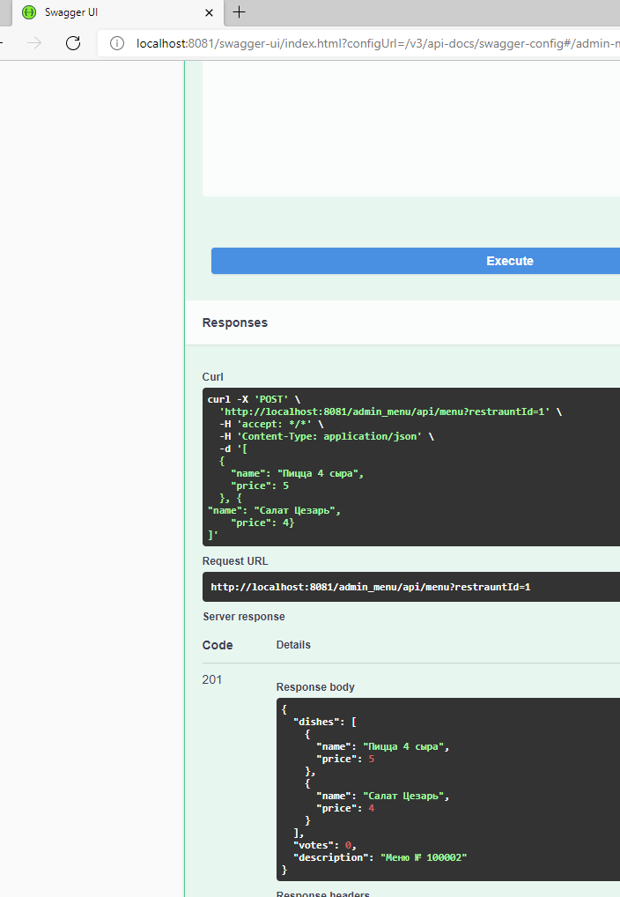
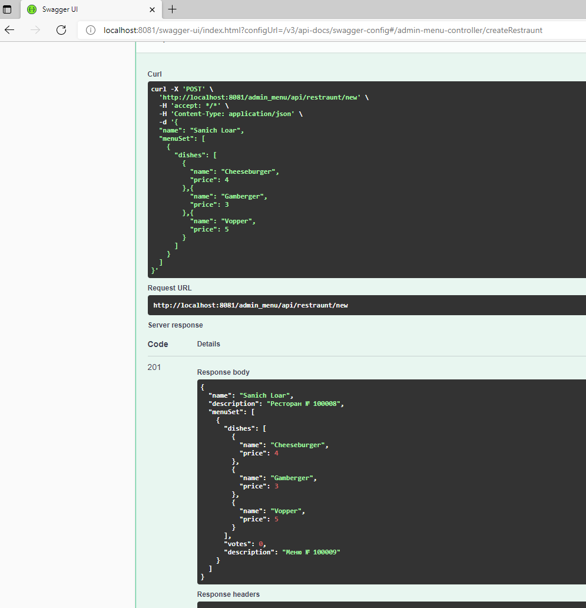

### **Swagger**

Swagger доступен по адресу [http://localhost:8081/swagger-ui-custom.html](http://localhost:8081/swagger-ui-custom.html) при локальном запуске сервиса. Большая часть методов запрашивает basic auth для авторизации пользователя, необходимо ввести соответствующую учётную запись из предопределённых в src\main\resources\db\h2\data.sql. Здесь объявлены 3 контроллера:

* [users-controller](http://localhost:8081/swagger-ui/index.html?configUrl=/v3/api-docs/swagger-config#/users-controller) - отвечает за управление пользователями (требуется роль администратора);
* [admin-menu-controller](http://localhost:8081/swagger-ui/index.html?configUrl=/v3/api-docs/swagger-config#/admin-menu-controller) - отвечает за редактирование меню ресторанов и добавление новых ресторанов (требуется роль администратора);
* [user-menu-controller](http://localhost:8081/swagger-ui/index.html?configUrl=/v3/api-docs/swagger-config#/user-menu-controller) - реализуется получение пользователем актуальных меню ресторанов (рестораны и меню в наличии фильтруются на сегодняшний день) и последующее голосование за понравившееся меню.

### **Действия пользователя**

Утилитой curl методы тестировались из Windows, поэтому местами добавлено экранирование и везде используются одинарные кавычки.

###### *Получение списка актуальных меню*

Перед голосанием пользователь анализирует список ресторанов и их актуальных (сегодняшних) меню с включёнными в состав меню блюдами и их ценами.

Cli:

```apache
curl -u user@yandex.ru:password -X "GET" "http://localhost:8081/user_menu/api/alltodaymenus" -H "accept: */*"
```

Swagger:



У каждого меню в описании есть ссылка на id меню, за которое можно проголосовать - это id используется при голосовании.

*Голосование за понравившееся меню*

После выполнения первого пункта необходимо проголосовать за номер (id) понравившегося меню

Cli:

```apache
curl -u user@yandex.ru:password -X "PUT" "http://localhost:8081/user_menu/api/menu/vote/{id}?id=1" -H "accept: */*"
```

Swagger:



В случае попытки изменения голоса в тот же день после 11 часов



*Где обедаем сегодня?*

Получение ресторана с наиболее высоким рейтингом меню на сегодня. Оценка происходит по полю votes сегодняшних меню ресторанов.

Cli:

```apache
curl -u user@yandex.ru:password -X "GET" "http://localhost:8081/user_menu/api/restraunt/best" -H "accept: */*"
```

Swagger:



#### **Действия администратора**

###### *Получение списка ресторанов*

Получить список объектов ресторанов с их меню и блюдами

Cli:

```apache
curl -u admin@gmail.com:admin -X "GET" "http://localhost:8081/admin_menu/api/restraunt/all" -H "accept: */*"
```

Swagger:



###### *Обновление меню ресторана на сегодня*

Можно обновить меню для ресторана после наступления нового дня (при этом предыдущее меню даже без обновления уже не будет выдаваться пользователям). К конкретному ресторану обращаемся по id из предыдущего списка.

Cli:

```apache
curl -u admin@gmail.com:admin -X "POST" "http://localhost:8081/admin_menu/api/menu?restrauntId=1" -H "accept: */*" -H "Content-Type: application/json" -d "[{\"name\":\"Pizza 4 cheese\",\"price\":5},{\"name\":\"Cesar Salad\",\"price\":4}]"
```

Swagger:



###### *Заведение нового ресторана с актуальным меню*

Заведение ресторана с новым именем и сегодняшним меню

Cli:

```apache
curl -u admin@gmail.com:admin -X "POST" "http://localhost:8081/admin_menu/api/restraunt/new" -H "accept: */*" -H "Content-Type: application/json" -d "{\"name\": \"Sanich Loar\",\"menuSet\": [{\"dishes\": [{\"name\": \"Cheeseburger\",\"price\": 4},{\"name\": \"Gamberger\",\"price\": 3},{\"name\": \"Vopper\",\"price\":7}]}]}"
```

Swagger:


